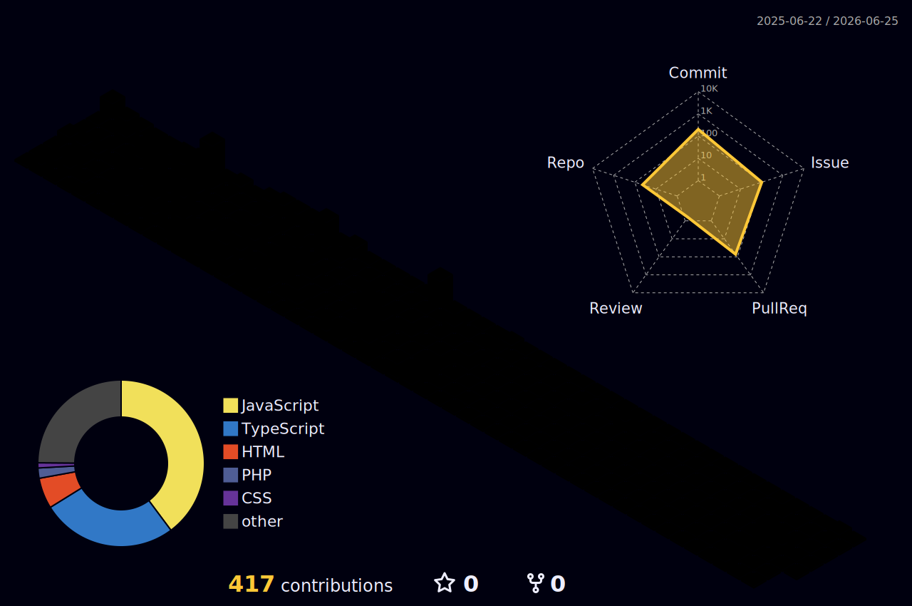

## 📌 About Me
- 🎓 Final-Year B.Tech student in Computer Science and Engineering
- 💡 Interested in software development, AI, open source, and practical problem solving
- 📊 Exploring deep learning, predictive modeling, and big data
- 🌱 Currently strengthening core-Java DSA and real-world project skills
- 🤝 Open to internships, collaborations, and impactful opportunities

 

## 📊 GitHub Stats

  
  

 

## 🛠️ Languages & Tools

### Web Development

### Databases

### Tools & Platforms

 

  ## 🧊 My 3D GitHub Contribution Graph

 

  

## 🏆 **Hacktoberfest 2025**

  

## 🔗 Connect with Me

  &nbsp;&nbsp;&nbsp;
  &nbsp;&nbsp;&nbsp;
  

 

  

  

